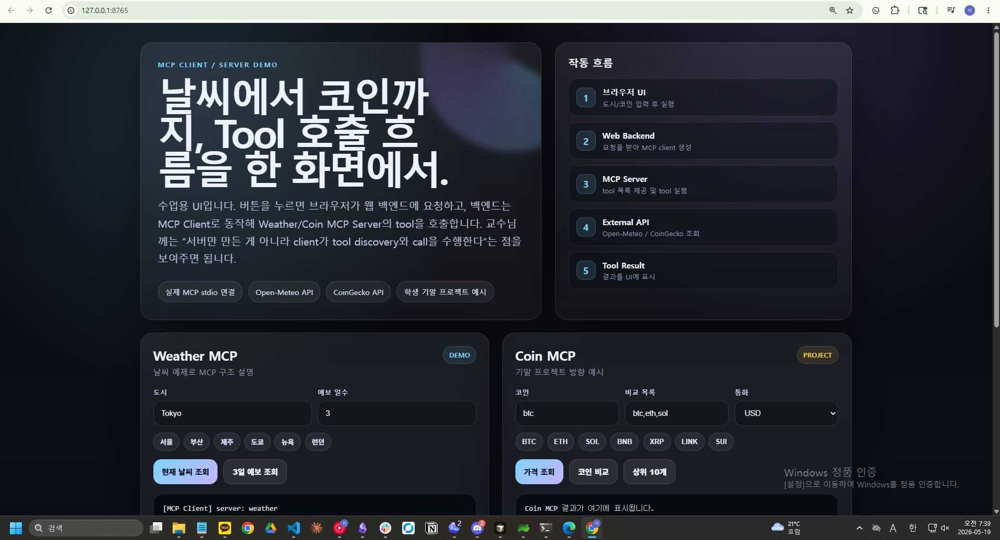
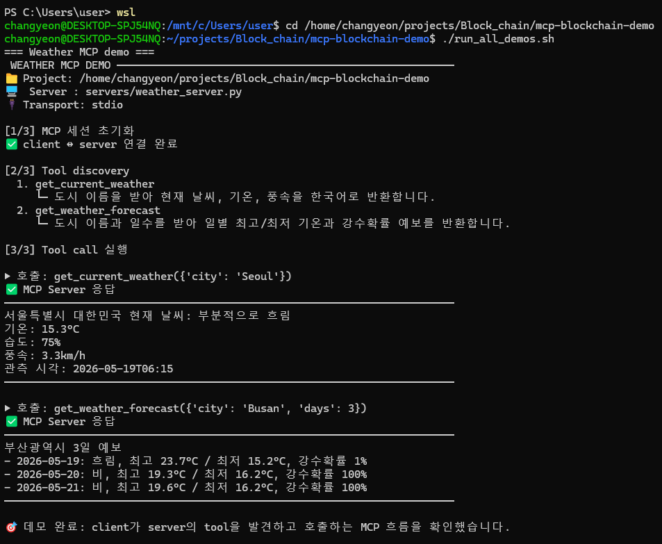
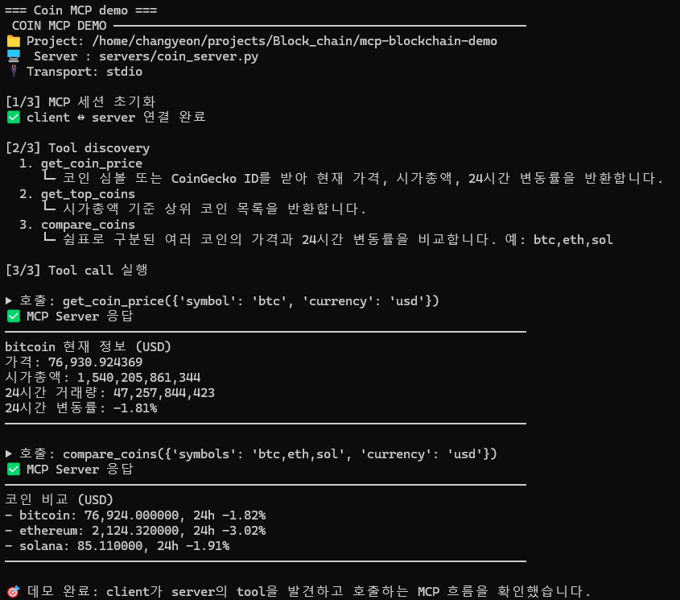

# MCP 날씨 데모 + 블록체인/코인 MCP 기말 프로젝트

이 폴더는 김형중 교수님과의 통화 이후 바로 수업에서 사용할 수 있도록 정리한 MCP 데모 자료입니다.

문서가 여러 개로 흩어져 있으면 확인하기 불편하므로, 기존의 데모 대본, MCP 구조 설명, 학생 프로젝트 가이드를 이 파일 하나에 통합했습니다.

현재 문서는 2개만 보면 됩니다.

```text
README.md       # 영어 / GitHub 공개용 설명
README_KR.md    # 한국어 / 수업 및 교수님 설명용 문서
```

---

## 1. 이 프로젝트의 목적

교수님이 물어보신 핵심 질문은 다음이었습니다.

> MCP 서버만 만든 것인가, 아니면 MCP client/server 구조가 분리되어 있는가?

이 프로젝트의 답은 다음과 같습니다.

1. MCP server는 실제 기능을 tool로 제공합니다.
2. MCP client는 server에 `stdio`로 연결합니다.
3. client는 `list_tools()`로 server가 제공하는 tool 목록을 조회합니다.
4. client는 `call_tool()`로 필요한 tool을 실제 인자와 함께 호출합니다.
5. server는 외부 API를 호출하고 결과를 tool result로 반환합니다.

즉, 단순 API 호출 코드도 아니고 서버만 있는 구조도 아닙니다. client와 server를 분리해서 보여주는 데모입니다.

```text
사용자 / 브라우저 / CLI
  ↓ 요청
MCP Client / Web Backend
  ↓ list_tools(), call_tool()
MCP Server
  ↓ 외부 API 요청
Open-Meteo 또는 CoinGecko
  ↓ 결과
MCP Server
  ↓ tool result
MCP Client / UI
  ↓ 표시
사용자
```

---

## 2. 프로젝트 구조

```text
mcp-blockchain-demo/
├── README.md                 # 영어 통합 문서
├── README_KR.md              # 한국어 통합 문서
├── pyproject.toml            # uv 기반 Python 의존성
├── uv.lock                   # 고정된 의존성 버전
├── run_all_demos.sh          # CLI 데모 전체 실행
├── run_ui.sh                 # 브라우저 UI 서버 실행
├── web_app.py                # Starlette backend, MCP client 역할
├── web/
│   └── index.html            # 브라우저 UI 데모 콘솔
├── assets/
│   └── screenshots/          # README에 포함되는 데모 스크린샷
├── servers/
│   ├── weather_server.py     # 날씨 MCP server
│   └── coin_server.py        # 코인/블록체인 MCP server
└── clients/
    └── test_mcp_client.py    # MCP client 역할을 보여주는 CLI 테스트 클라이언트
```

---

## 3. 설치 요구사항

- Python 3.11 이상
- [`uv`](https://docs.astral.sh/uv/) 패키지 매니저
- WSL/Linux shell 권장
- 라이브 API 호출을 위한 인터넷 연결

사용하는 외부 API:

- [Open-Meteo](https://open-meteo.com/) — API key 불필요
- [CoinGecko public API](https://www.coingecko.com/en/api) — 이 데모에서는 API key 불필요

설치되는 주요 Python 패키지:

- `mcp`: MCP server/client SDK
- `httpx`: Weather API, CoinGecko API 호출
- `starlette`, `uvicorn`: Web UI backend

---

## 4. 설치 방법

```bash
cd week/mcp-blockchain-demo
uv sync
```

현재 WSL 작업 폴더 기준으로는 다음과 같습니다.

```bash
cd /home/changyeon/projects/Block_chain_repo/week/mcp-blockchain-demo
uv sync
```

---

## 5. CLI 데모 실행

Weather와 Coin 데모를 한 번에 실행:

```bash
./run_all_demos.sh
```

각각 따로 실행:

```bash
uv run python clients/test_mcp_client.py weather
uv run python clients/test_mcp_client.py coin
```

수업용 기본 출력은 MCP/HTTP 내부 로그를 숨기고 핵심 흐름만 보여줍니다.

```text
[1/3] MCP session initialization
[2/3] Tool discovery
[3/3] Tool call execution
```

문제 해결이 필요하면 내부 로그까지 확인합니다.

```bash
uv run python clients/test_mcp_client.py weather --verbose
uv run python clients/test_mcp_client.py coin --verbose
```

---

## 6. Web UI 실행

UI 서버 실행:

```bash
./run_ui.sh
```

브라우저에서 접속:

```text
http://127.0.0.1:8765
```

이 Web UI는 단순 정적 대시보드가 아닙니다. 브라우저가 로컬 Starlette backend를 호출하고, 그 backend가 MCP client 역할을 합니다.

```text
Browser UI
  ↓ HTTP 요청
Starlette backend / MCP client
  ↓ MCP ClientSession
MCP server
  ↓ 외부 API 요청
Open-Meteo 또는 CoinGecko
```

UI에서 확인할 수 있는 기능:

- 현재 날씨 조회
- 여러 날짜 날씨 예보
- 코인 가격 조회
- 코인 비교
- 시가총액 상위 코인 목록
- tool discovery 시각화

---

## 7. 데모 스크린샷

아래 이미지는 수업/데모용으로 포함한 화면입니다. 브라우저 UI와 CLI client가 모두 같은 MCP client → server → external API 흐름을 실행한다는 점을 보여줄 때 사용하면 됩니다.

### Web UI 전체 화면



브라우저 UI에서 Weather/Coin MCP 데모 콘솔과 브라우저 요청부터 MCP server tool result까지 이어지는 5단계 흐름을 보여줍니다.

### Weather CLI 데모



Weather CLI 데모는 MCP 세션 초기화, tool discovery, `servers/weather_server.py`에 대한 `call_tool()` 실행을 보여줍니다.

### Coin CLI 데모



Coin CLI 데모는 client가 Coin MCP tool을 발견하고 `servers/coin_server.py`의 가격 조회/코인 비교 tool을 호출하는 흐름을 보여줍니다.

---

## 8. 이 데모의 MCP tool

### Weather MCP Server

파일: `servers/weather_server.py`

| Tool | 설명 |
|---|---|
| `get_current_weather(city)` | 현재 날씨, 기온, 습도, 풍속, 관측 시각 반환 |
| `get_weather_forecast(city, days)` | 일별 날씨, 최고/최저 기온, 강수 확률 반환 |

### Coin MCP Server

파일: `servers/coin_server.py`

| Tool | 설명 |
|---|---|
| `get_coin_price(symbol, currency)` | 현재 가격, 시가총액, 거래량, 24시간 변동률 반환 |
| `get_top_coins(limit, currency)` | 시가총액 기준 상위 코인 반환 |
| `compare_coins(symbols, currency)` | 여러 코인의 가격과 24시간 변동률 비교 |

지원되는 축약 심볼 예시:

```text
btc, eth, sol, xrp, ada, doge
```

---

## 9. MCP client/server 구조 설명

MCP가 해결하는 문제는 단순합니다.

LLM은 자연어 이해는 잘하지만, 외부 API를 직접 안정적으로 호출하거나 로컬 프로그램을 실행하는 표준 방식은 기본적으로 없습니다.

MCP는 외부 기능을 `tool`로 정의하고, MCP client 또는 LLM host가 그 tool을 표준 프로토콜로 호출하게 합니다.

### 구성요소

| 구성요소 | 역할 | 이 데모에서의 매핑 |
|---|---|---|
| 사용자 | 자연어로 요청 | “서울 날씨 알려줘”, “비트코인 가격 알려줘” |
| MCP Client / LLM Host | 어떤 tool이 필요한지 판단하고 호출 | `clients/test_mcp_client.py`, `web_app.py` |
| MCP Server | 실제 기능을 tool로 제공 | `servers/weather_server.py`, `servers/coin_server.py` |
| External API | 실제 데이터를 제공 | Open-Meteo, CoinGecko |

### 요청 흐름

```text
1. 사용자: “서울 날씨 알려줘”
2. MCP Client / LLM Host: 날씨 조회 tool이 필요하다고 판단
3. MCP Client: get_current_weather(city="Seoul") 호출
4. MCP Server: Open-Meteo API 호출
5. External API: 실시간 날씨 데이터 반환
6. MCP Server: tool result 반환
7. MCP Client / LLM Host: 결과를 표시하거나 자연어 답변 생성
```

### 학생들이 헷갈리기 쉬운 부분

단순히 API 호출 코드를 만들었다고 MCP 프로젝트가 되는 것은 아닙니다.

MCP 프로젝트가 되려면 최소한 다음이 필요합니다.

1. 외부 API 또는 로컬 기능을 호출하는 함수
2. 그 함수를 tool로 노출하는 MCP server
3. `list_tools()`와 `call_tool()`을 검증하는 client 또는 LLM host
4. 자연어 요청이 어떤 tool 호출로 연결되는지에 대한 설명

---

## 10. 교수님께 설명할 핵심 답변

교수님 질문은 “서버만 만든 것이냐, 클라이언트와 서버를 나눈 것이냐”였습니다.

답변은 이렇게 하면 됩니다.

> MCP에서는 실제 API 호출 기능은 MCP server에 tool로 구현합니다. 사용자의 자연어 요청은 MCP client 또는 LLM host가 해석하고, 필요한 tool을 MCP server에 요청합니다. 그래서 구조상 client/host와 server가 분리됩니다. 오늘 데모에서는 weather MCP server를 띄우고, test MCP client가 server의 tool 목록을 조회한 뒤 날씨 tool을 호출하는 흐름을 보여드리겠습니다.

파일 기준으로는 다음과 같습니다.

```text
servers/weather_server.py      # MCP server
servers/coin_server.py         # MCP server
clients/test_mcp_client.py     # MCP client
web_app.py                     # Web backend이면서 MCP client
```

즉, 구조적으로 client와 server가 분리되어 있습니다.

---

## 11. 수업용 데모 대본

### 11-1. 시작 멘트

오늘은 MCP가 어떤 식으로 LLM과 외부 API를 연결하는지 간단한 날씨 예제로 보여드리겠습니다.

핵심은 AI가 직접 날씨 API를 호출하는 것이 아니라, MCP server가 날씨 조회 기능을 tool로 제공하고, MCP client 또는 LLM host가 그 tool을 호출한다는 점입니다.

### 11-2. 구조 설명

```text
사용자
  ↓ 자연어 질문
MCP Client / LLM Host
  ↓ tool 호출
MCP Server
  ↓ API 요청
Weather API 또는 Coin API
  ↓ 결과
MCP Server
  ↓ tool result
MCP Client / LLM Host
  ↓ 자연어 답변 또는 UI 표시
사용자
```

설명 포인트:

- MCP Server: 실제 기능을 가진 tool을 제공하는 쪽입니다.
- MCP Client / LLM Host: 사용자 요청을 해석하고 필요한 tool을 호출하는 쪽입니다.
- External API: 날씨 API, 코인 API, 블록체인 API처럼 실제 데이터를 제공하는 서비스입니다.

### 11-3. 실행 명령

```bash
uv run python clients/test_mcp_client.py weather
```

### 11-4. Tool 목록 조회 설명

출력에서 다음 부분을 보여줍니다.

```text
[MCP Client] discovered tools:
- get_current_weather
- get_weather_forecast
```

설명:

MCP client가 server에 “어떤 tool을 제공하느냐”고 물어보고, server가 tool 목록을 반환한 것입니다.

### 11-5. Tool 호출 설명

출력에서 다음 부분을 보여줍니다.

```text
[MCP Client] calling tool: get_current_weather({'city': 'Seoul'})
```

설명:

여기서 client가 server의 `get_current_weather` tool을 호출합니다. server는 내부적으로 Open-Meteo API를 호출한 뒤 결과를 반환합니다.

### 11-6. 결과 반환 설명

출력에서 다음 같은 결과를 보여줍니다.

```text
서울특별시 대한민국 현재 날씨: ...
기온: ...
습도: ...
풍속: ...
```

이 결과는 외부 Weather API에서 온 데이터를 MCP server가 정리해서 client에게 돌려준 것입니다.

### 11-7. 블록체인 프로젝트로 확장

날씨 예제에서 API와 tool만 바꾸면 학생 기말 프로젝트가 됩니다.

```text
Weather API → CoinGecko / Coinbase / Binance / Etherscan API
날씨 조회 tool → 코인 가격 조회, 거래량 조회, 지갑 잔액 조회, 트랜잭션 조회 tool
```

예시 자연어 질의:

- “비트코인 현재 가격 알려줘”
- “이더리움과 솔라나 24시간 변동률 비교해줘”
- “시가총액 상위 10개 코인 보여줘”
- “이 트랜잭션 해시의 상태를 조회해줘”

### 11-8. 마무리 멘트

정리하면 MCP의 핵심은 외부 기능을 LLM에게 직접 붙이는 것이 아니라, MCP server가 표준화된 tool 인터페이스로 제공하고 MCP client/LLM host가 그 tool을 호출하게 하는 것입니다.

오늘 날씨 데모는 가장 단순한 예제이고, 기말 프로젝트에서는 이 구조를 코인 또는 블록체인 실시간 데이터 조회로 확장하면 됩니다.

---

## 12. 학생 기말 프로젝트 가이드

### 12-1. 프로젝트 주제

기말 프로젝트는 MCP server를 만들어 코인 또는 블록체인 관련 실시간 정보를 tool로 제공하는 것입니다.

예시 주제:

- 실시간 코인 가격 조회 MCP
- 코인 가격/거래량 비교 MCP
- 상위 코인 시장 요약 MCP
- 특정 지갑 주소의 블록체인 정보 조회 MCP
- 특정 트랜잭션 해시 조회 MCP
- NFT 컬렉션 가격/거래량 조회 MCP

### 12-2. 기본 요구사항

최소 요구사항:

1. MCP server를 직접 구현한다.
2. tool을 2개 이상 제공한다.
3. 외부 API를 1개 이상 연동한다.
4. MCP client에서 tool 목록 조회와 tool 호출을 검증한다.
5. README에 실행 방법, 구조도, 예시 질의를 작성한다.

### 12-3. 추천 API

| 난이도 | API | 설명 |
|---|---|---|
| 쉬움 | CoinGecko API | API key 없이 시작 가능, 가격/시가총액/거래량/변동률 조회 가능 |
| 중간 | Coinbase API | 거래소 가격 정보 조회에 적합 |
| 중간 | Binance API | 거래쌍, 호가, 캔들 데이터 조회 가능 |
| 어려움 | Etherscan API | Ethereum 주소, 트랜잭션, 컨트랙트 조회 가능, API key 필요 가능 |
| 어려움 | Solscan API | Solana 계정/트랜잭션 조회 가능 |

### 12-4. 예시 tool 설계

```text
get_coin_price(symbol, currency)
get_market_summary(symbol)
get_top_coins(limit)
compare_coins(symbols)
get_transaction(tx_hash)
get_wallet_balance(address)
get_latest_blocks(limit)
```

예시:

- `get_coin_price("btc", "usd")` → 비트코인 현재 가격, 시가총액, 24시간 변동률
- `compare_coins(["btc", "eth", "sol"], "usd")` → BTC/ETH/SOL 가격과 변동률 비교
- `get_wallet_balance(address)` → 특정 지갑의 잔액 조회

### 12-5. 예시 자연어 질의

학생들은 아래 같은 질의가 tool 호출로 연결되도록 설계하면 됩니다.

- “비트코인 현재 가격 알려줘”
- “이더리움 24시간 변동률 알려줘”
- “비트코인, 이더리움, 솔라나를 비교해줘”
- “시가총액 상위 10개 코인 보여줘”
- “이 지갑 주소의 ETH 잔액 알려줘”
- “이 트랜잭션 해시의 상태를 조회해줘”

### 12-6. 제출물

필수 제출물:

```text
project/
├── server.py 또는 servers/*.py
├── client_test.py
├── README.md
└── requirements.txt 또는 pyproject.toml
```

README에는 반드시 포함:

1. 프로젝트 주제
2. MCP 구조도
3. 제공 tool 목록
4. 외부 API 설명
5. 설치 방법
6. 실행 방법
7. 테스트 질의 예시
8. 실행 결과 캡처 또는 로그

### 12-7. 평가 기준 예시

| 항목 | 배점 예시 |
|---|---:|
| MCP server 구현 | 25 |
| tool 설계의 명확성 | 20 |
| 외부 API 연동 | 20 |
| client 호출 검증 | 15 |
| README/발표 설명 | 10 |
| 에러 처리/완성도 | 10 |

### 12-8. 감점 요소

- 단순 API 호출만 있고 MCP tool로 노출하지 않은 경우
- client에서 `list_tools()` / `call_tool()` 검증이 없는 경우
- 실행 방법이 불명확한 경우
- API key를 코드에 하드코딩한 경우
- 없는 코인/잘못된 주소/API 장애/rate limit 처리가 없는 경우
- README 없이 코드만 제출한 경우

### 12-9. 확장 아이디어

- 가격 변동률 기준 급등/급락 코인 찾기
- BTC/ETH/SOL 비교 리포트 생성
- 특정 지갑 주소의 토큰 보유 현황 조회
- 특정 트랜잭션 해시 상태 분석
- Gas fee 추적
- DeFi TVL 조회
- NFT floor price 조회
- 한국어 자연어 질의에 특화된 코인 분석 MCP

---

## 13. 수업 운영 제안

### 내일

- 학생 제안서 발표
- Weather MCP 데모
- MCP client/server 구조 설명

### 다음 주

- 학생들이 본인 제안서 기반 미니 데모 시연
- 최소 요구사항: MCP server 1개 + tool 2개 이상 + client에서 호출 검증

### 기말 주간

- Coin/Blockchain 실시간 정보 조회 MCP 프로젝트
- 예: 비트코인 가격, 24시간 변동률, 거래량, 상위 코인, 코인 비교, 지갑/트랜잭션 조회

---

## 14. 데모가 실패할 때 백업 플랜

네트워크/API 문제로 라이브 호출이 실패하면 아래 순서로 설명합니다.

1. `servers/weather_server.py`에서 tool 정의를 보여준다.
2. `clients/test_mcp_client.py`에서 `list_tools()`와 `call_tool()` 부분을 보여준다.
3. 이전 실행 결과 캡처 또는 터미널 로그를 보여준다.
4. 핵심은 “MCP server가 tool을 제공하고 client가 호출한다”는 구조라고 설명한다.

외부 API가 실패해도 MCP 구조 설명은 여전히 가능합니다.

---

## 15. 검증 명령

문법 확인:

```bash
python -m py_compile clients/test_mcp_client.py web_app.py servers/weather_server.py servers/coin_server.py
```

CLI smoke test:

```bash
./run_all_demos.sh
```

Web UI 서버 실행 후 API 확인:

```bash
curl http://127.0.0.1:8765/api/tools
curl 'http://127.0.0.1:8765/api/weather/current?city=Seoul'
curl 'http://127.0.0.1:8765/api/coin/price?symbol=btc&currency=usd'
```

---

## 16. GitHub 업로드 시 포함할 파일

포함 권장:

- Source: `servers/`, `clients/`, `web/`, `web_app.py`
- Docs: `README.md`, `README_KR.md`
- Dependency: `pyproject.toml`, `uv.lock`
- Scripts: `run_all_demos.sh`, `run_ui.sh`

포함하지 않을 것:

- `.venv/`
- `__pycache__/`
- `.pytest_cache/`
- local logs
