# 04. 실습: 지갑 간 송금과 트랜잭션 추적

> [!info] 학습 목표
> 1. GIWA Sepolia 테스트넷에서 실제 ETH 송금을 수행한다
> 2. 트랜잭션 해시를 통해 Nonce, Gas, Signature를 **직접 눈으로** 확인한다
> 3. 이론에서 배운 개념이 실제 트랜잭션에 어떻게 반영되는지 체험한다

**사전 학습**: [[02-중급-Nonce-Gas-Signature]]

> [!quote] 이 실습의 핵심
> "블록체인은 추상적인 이론이 아니다 — 모든 것이 **숫자로 기록되고, 누구나 검증할 수 있다**."

---

## 실습 전체 흐름

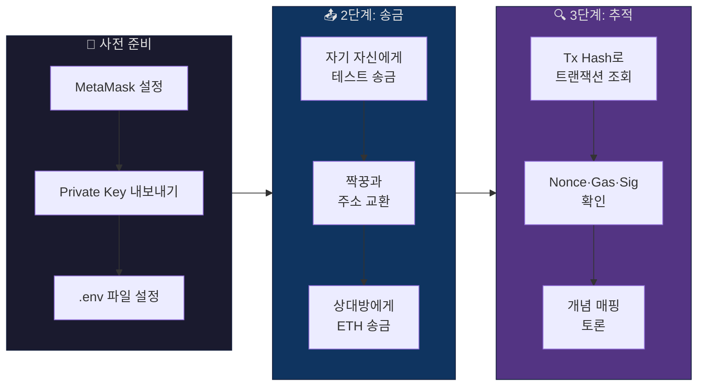

---

## 1. 사전 준비

### 1-1. MetaMask에 GIWA Sepolia 네트워크 추가

| 항목 | 값 |
|------|-----|
| **네트워크 이름** | GIWA Sepolia |
| **RPC URL** | `https://sepolia-rpc.giwa.io/` |
| **Chain ID** | `91342` |
| **통화 기호** | ETH |
| **Explorer URL** | `https://sepolia-explorer.giwa.io/` |

> [!tip] MetaMask 네트워크 추가 경로
> MetaMask → 설정(⚙️) → 네트워크 → **네트워크 추가** → 위 정보 입력

### 1-2. Private Key 내보내기 → `.env` 설정

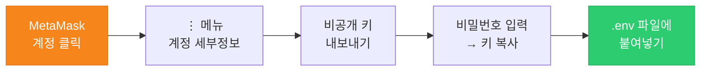

```env
# .env 파일
PRIVATE_KEY=여기에_복사한_개인키_붙여넣기
```

> [!danger] Private Key 보안 경고
> - Private Key는 **절대 다른 사람에게 공유하지 않는다**
> - 짝꿍과 교환하는 것은 **지갑 주소(0x...)** 뿐이다
> - `.env` 파일은 `.gitignore`에 포함되어 Git에 올라가지 않는다
>
> | 공유 가능 | 공유 불가 |
> |-----------|-----------|
> | 지갑 주소 `0x...` | Private Key |
> | Tx Hash | .env 파일 |
> | 공개키 (Public Key) | 시드 구문 (12/24단어) |

---

## 2. 2단계: 지갑 간 송금

### 2-1. 실습 진행 순서

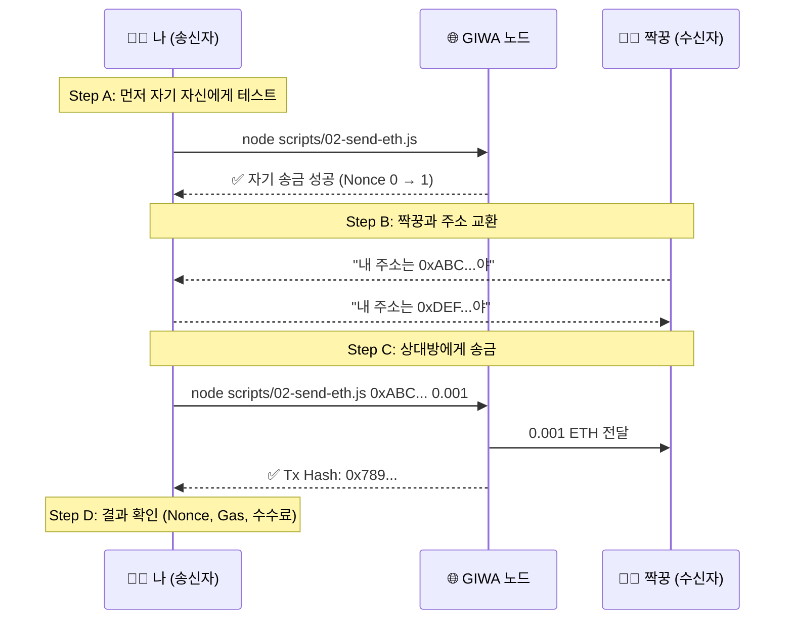

---

### Step A: 자기 자신에게 테스트 송금

> [!example] 실행 명령어
> ```bash
> node scripts/02-send-eth.js
> ```
> 받는 주소를 생략하면 **자기 자신에게** 0.001 ETH를 보낸다.
> 스크립트가 정상 동작하는지 먼저 확인하는 용도이다.

**예상 출력:**

```
  [송금 전 상태]
  잔액      : 0.1 ETH
  현재 Nonce: 0
  → 이번 tx는 Nonce 0 으로 발행됩니다

  ⏳ 트랜잭션 전송 중...

  ✅ 트랜잭션 완료!

  [트랜잭션 영수증]
  블록 번호 : 12345
  상태      : 성공 ✅
  Gas Used  : 21000 (실제 사용량)
  Gas Price : 0.001 Gwei
  실제 수수료: 0.000000021 ETH

  [송금 후 상태]
  잔액      : 0.099999979 ETH
  현재 Nonce: 1 ← Nonce가 0 → 1 로 +1 증가!
```

> [!warning] 자기 송금인데 왜 잔액이 줄어들었을까?
> 보낸 금액(0.001 ETH)은 자기에게 다시 돌아오지만,
> **Gas 수수료**(0.000000021 ETH)는 네트워크에 지불한 것이므로 **돌아오지 않는다**.
>
> ```
> 잔액 변화 = 송금액(자기에게 복귀) − Gas 수수료(네트워크에 지불)
>           = 0                     − 0.000000021
>           = −0.000000021 ETH
> ```

---

### Step B: 짝꿍과 주소 교환

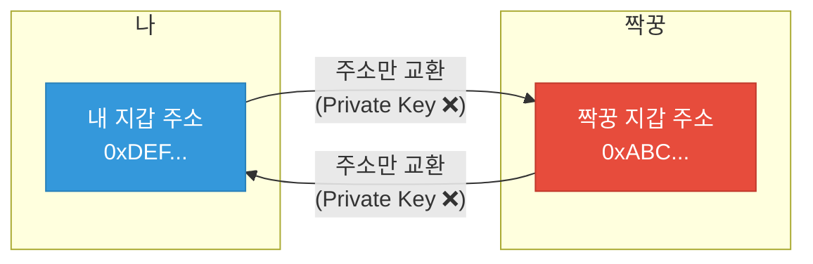

> [!tip] 주소 교환 방법
> - MetaMask에서 자기 주소를 **복사** → 카카오톡/슬랙으로 전달
> - 또는 QR 코드로 교환

---

### Step C: 상대방에게 송금

> [!example] 실행 명령어
> ```bash
> node scripts/02-send-eth.js 0x짝꿍주소 0.001
> ```

---

### Step D: 출력 결과에서 확인해야 할 핵심 항목

| 항목 | 예시 값 | 의미 | 관련 개념 |
|------|---------|------|-----------|
| **송금 전 Nonce** | `1` | 이전까지 보낸 트랜잭션 수 | [[02-중급-Nonce-Gas-Signature#1. Nonce 심화]] |
| **송금 후 Nonce** | `2` | +1 증가 확인 | 리플레이 공격 방지 |
| **Gas Used** | `21000` | 단순 전송의 고정 Gas | 연산 비용 단위 |
| **Gas Price** | `0.001 Gwei` | Gas 1단위당 가격 | EIP-1559 |
| **실제 수수료** | `0.000000021 ETH` | gasUsed × gasPrice | 스팸 방지 |
| **Tx Hash** | `0x789...` | 트랜잭션 고유 식별자 | **3단계에서 사용** |

> [!success] Tx Hash를 반드시 복사해두세요!
> 3단계 트랜잭션 추적에서 이 해시를 사용합니다.

---

### 토론 질문

> [!question] 학생들에게 던질 질문
>
> **Q1. Nonce가 왜 1에서 2로 올랐을까?**
> → 같은 트랜잭션이 두 번 처리되는 것을 방지하기 위해서이다 (리플레이 공격 방지)
>
> **Q2. 0.001 ETH를 보냈는데 잔액이 0.001보다 더 줄었다. 왜?**
> → 보낸 금액 + Gas 수수료가 함께 차감되기 때문이다
>
> **Q3. Gas가 없으면 어떤 문제가 생길까?**
> → 악의적 사용자가 무한으로 트랜잭션을 보내 네트워크를 마비시킬 수 있다 (DoS 공격)
>
> **Q4. 자기 자신에게 송금하면 돈이 왜 줄어들까?**
> → 금액은 돌아오지만, Gas 수수료는 네트워크에 지불되므로 환불되지 않는다

---

## 3. 3단계: 트랜잭션 추적

### 3-1. 추적 방법 (2가지)

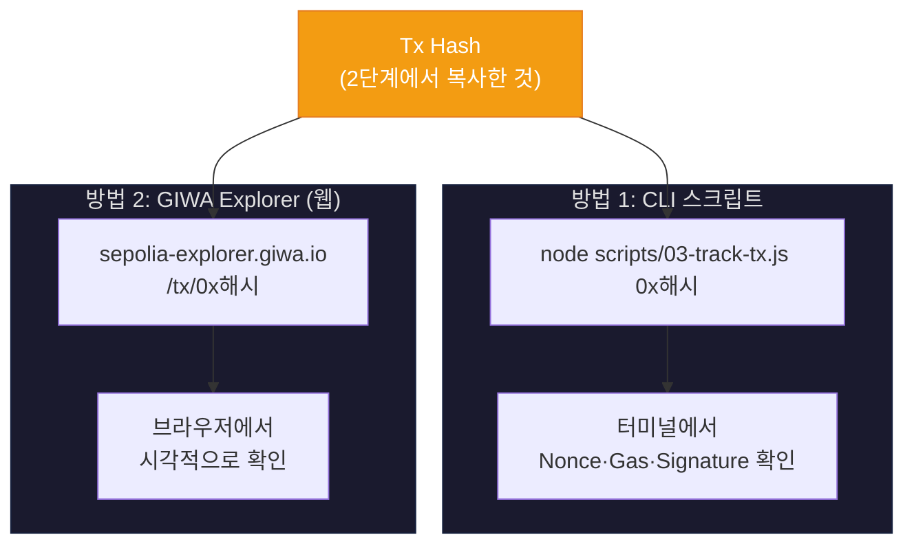

> [!example] CLI로 추적
> ```bash
> node scripts/03-track-tx.js 0x2단계에서_복사한_해시
> ```

> [!example] 웹 Explorer로 추적
> 브라우저에서 아래 주소에 접속한다:
> ```
> https://sepolia-explorer.giwa.io/tx/0x2단계에서_복사한_해시
> ```

---

### 3-2. 트랜잭션에서 확인할 수 있는 정보 전체 구조

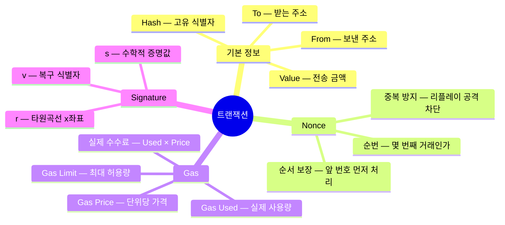

---

### 3-3. 핵심 개념 심화 설명

#### 개념 1: Nonce — "이 트랜잭션이 몇 번째인가"

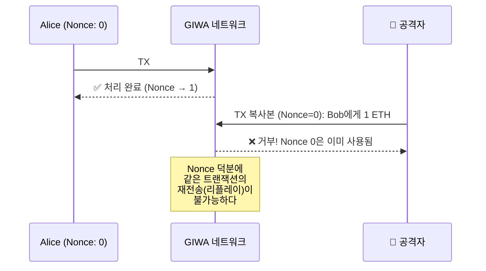

> [!abstract] 핵심 정리
> | 속성 | 설명 |
> |------|------|
> | **시작값** | 0 (해당 주소의 첫 번째 트랜잭션) |
> | **증가 규칙** | 트랜잭션 성공 시 +1 |
> | **범위** | 계정별 독립 (Alice와 Bob의 Nonce는 무관) |
> | **핵심 역할** | 리플레이 공격 방지 + 트랜잭션 순서 보장 |

> [!warning] Nonce가 꼬이면 일어나는 일
> ```
> 현재 Nonce = 3인 상태에서...
>
> Nonce 5인 트랜잭션을 먼저 보냄
> → ❌ pending (대기) 상태로 멈춤
> → Nonce 3, 4가 먼저 처리될 때까지 영원히 대기
>
> 해결: Nonce 3 → 4 → 5 순서대로 보내야 함
> ```

---

#### 개념 2: Gas — "트랜잭션 수수료"

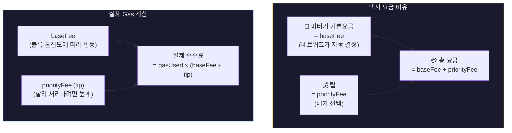

##### Gas Limit vs Gas Used

> [!important] 이 둘의 차이를 반드시 구분해야 한다

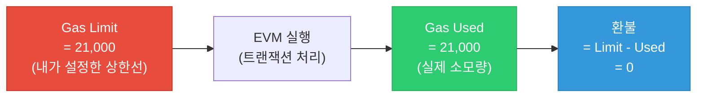

| 구분 | Gas Limit | Gas Used |
|------|-----------|----------|
| **정의** | 사용자가 허용하는 최대 Gas | 실제 소모된 Gas |
| **설정 주체** | 사용자 (또는 지갑이 자동 추정) | 네트워크가 실행 후 확정 |
| **단순 ETH 전송** | 21,000 | 21,000 (항상 동일) |
| **스마트 컨트랙트** | 예측 필요 (estimateGas) | 복잡도에 따라 달라짐 |
| **Limit < 필요량일 때** | 실행 도중 실패 (out of gas) | 쓴 만큼만 기록, **환불 없음** |

> [!danger] Gas Limit을 너무 낮게 잡으면?
> - 트랜잭션 실행 도중 Gas가 바닥남 → **즉시 실패 (revert)**
> - 그런데 **이미 쓴 Gas 비용은 환불되지 않는다**
> - 즉, 수수료만 날리고 트랜잭션은 실패하는 최악의 상황
>
> ```
> 예시:
> Gas Limit = 15,000 (너무 낮게 설정)
> 실제 필요 = 21,000
> → 15,000 지점에서 실행 중단
> → 15,000 Gas 비용 차감됨 (환불 없음)
> → 트랜잭션 상태: 실패 ❌
> ```

---

#### 개념 3: Signature (r, s, v) — "내가 보냈다는 증명"

> [!tip] 이 개념이 가장 어렵다. 비유부터 시작하자.

##### 비유: 위조 불가능한 도장

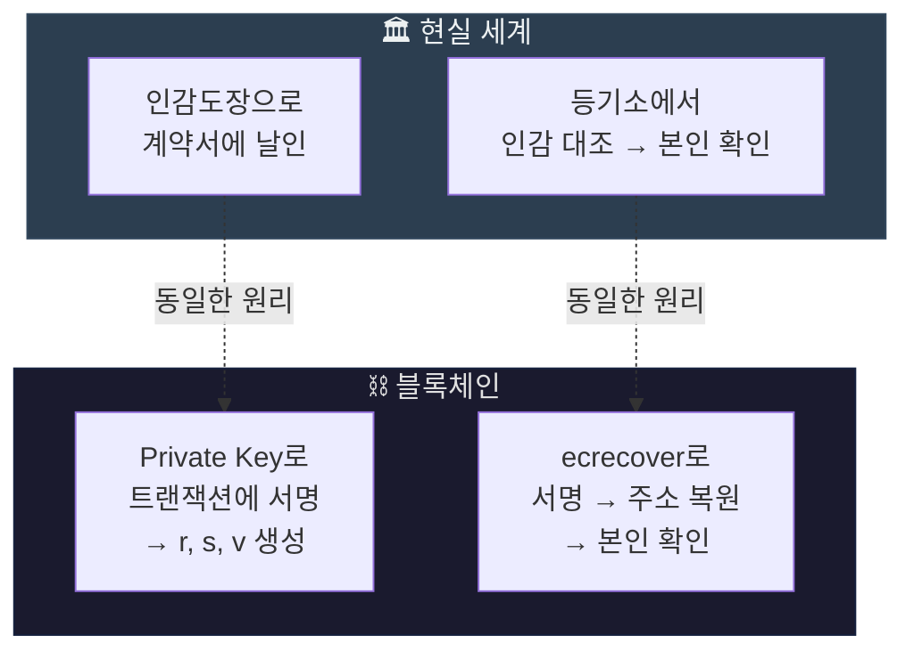

##### 서명의 생성과 검증 과정

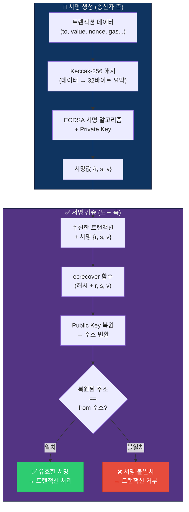

##### r, s, v 각각의 의미

| 값 | 크기 | 비유 | 기술적 의미 |
|----|------|------|-------------|
| **r** | 32 bytes | 도장의 **모양** | 서명 과정에서 생성된 타원곡선 위의 점의 x좌표 |
| **s** | 32 bytes | 도장의 **잉크 패턴** | Private Key와 r을 조합해 계산한 수학적 증명값 |
| **v** | 1 byte | 도장을 **어느 방향으로 읽는지** 표시 | Public Key 복원 시 2개 후보 중 정답을 고르는 힌트 |

> [!abstract] 가장 핵심적인 포인트
>
> ```
> ┌──────────────────────────────────────────────────┐
> │  서명(r, s, v)만 있으면                            │
> │  → 누가 보냈는지 알 수 있다 (주소 복원 가능)          │
> │                                                    │
> │  하지만 서명(r, s, v)에서                           │
> │  → Private Key는 절대 알아낼 수 없다                 │
> │                                                    │
> │  이것이 타원곡선 암호(ECDSA)의 핵심 보안 속성이다     │
> └──────────────────────────────────────────────────┘
> ```

##### 왜 역방향 계산이 불가능한가? (색 섞기 비유)

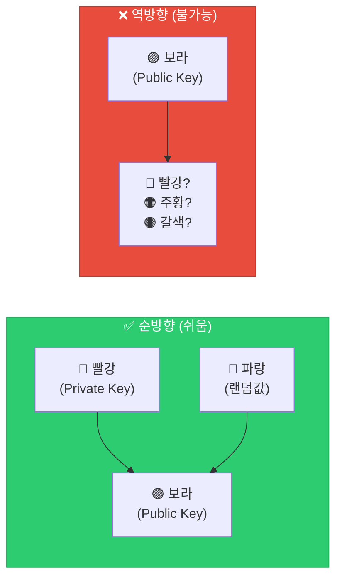

> [!info] 수학적 배경 (관심 있는 학생용)
> - 이더리움은 **secp256k1** 타원곡선을 사용한다
> - `Public Key = Private Key × G` (G는 고정된 생성점)
> - 곱셈(순방향)은 컴퓨터로 즉시 가능
> - 나눗셈(역방향, 이산 로그 문제)은 현재 기술로 **수십억 년** 소요
> - 양자 컴퓨터가 실용화되면 깨질 수 있다 → 이더리움도 양자 내성 암호 연구 중

---

## 4. 실습 결과물 예시

### CLI 스크립트 출력 전체 흐름

```
  ============================================
   3단계: 트랜잭션 추적
  ============================================

  [트랜잭션 기본 정보]
  Hash      : 0x789abc...
  From      : 0xDEF...  ← 보낸 사람 (나)
  To        : 0xABC...  ← 받는 사람 (짝꿍)
  Value     : 0.001 ETH
  Nonce     : 1         ← 두 번째 트랜잭션
  Gas Limit : 21000

  [서명 정보 (Private Key 소유 증명)]
  r : 0x3a8f...  ← 타원곡선 x좌표
  s : 0x7b2e...  ← 수학적 증명값
  v : 1          ← 복구 식별자

  [트랜잭션 영수증 (블록 포함 후)]
  상태      : 성공 ✅
  블록 번호 : 12345
  Gas Used  : 21000
  Gas Price : 0.001 Gwei
  실제 수수료: 0.000000021 ETH
```

### Explorer에서 확인하는 화면과 대응

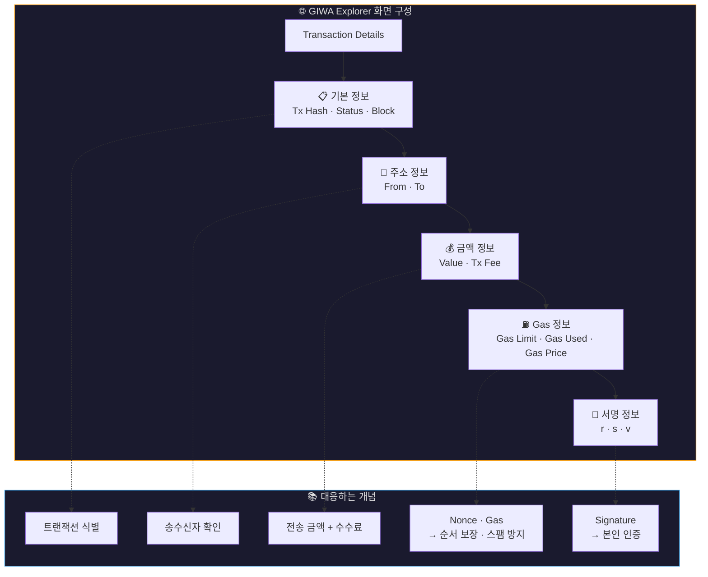

---

## 5. 전체 개념 연결 — 트랜잭션의 생애주기

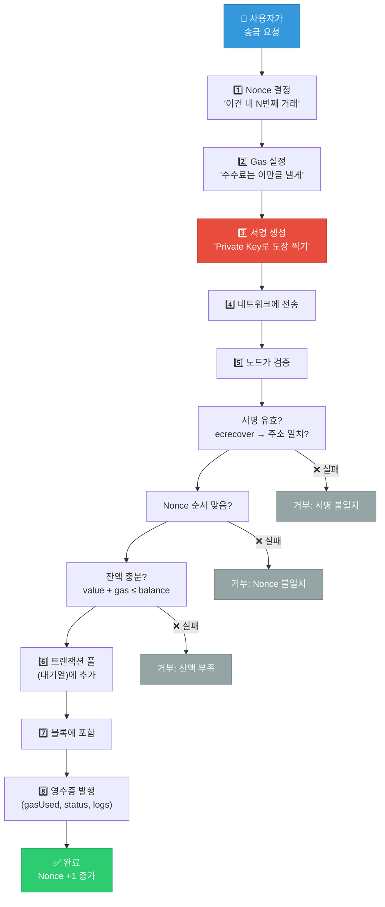

---

## 6. 핵심 요약 — 한 장 정리

> [!summary] 3주차 핵심 개념 한눈에 보기
>
> | 개념 | 한 줄 정의 | 없으면 일어나는 일 | 비유 |
> |------|-----------|-------------------|------|
> | **Nonce** | 트랜잭션 순번 | 같은 거래가 무한 반복됨 (리플레이 공격) | 택배 송장 일련번호 |
> | **Gas** | 네트워크 사용 수수료 | 무한 스팸으로 네트워크 마비 (DoS 공격) | 택시 미터기 요금 |
> | **Signature** | Private Key로 만든 디지털 서명 | 누구나 남의 돈을 보낼 수 있음 | 위조 불가능한 인감도장 |
>
> ```
> 트랜잭션 = Nonce(순서) + Gas(수수료) + Signature(인증)
>          = "몇 번째"  + "얼마 낼지" + "내가 보냈다는 증명"
> ```

---

## 다음 단계

이 실습을 완료했다면, 서명 검증 실습으로 넘어간다:

> [!tip] 4단계: 서명 검증
> ```bash
> node scripts/04-verify-sig.js
> ```
> 임의의 메시지에 서명하고, 서명에서 주소를 복원하여 본인 인증을 직접 체험한다.

**이전 문서**: [[02-중급-Nonce-Gas-Signature]]
**다음 문서**: [[03-고급-L2아키텍처와-보안]]

---

#blockchain #GIWA #Sepolia #실습 #Nonce #Gas #Signature #트랜잭션
