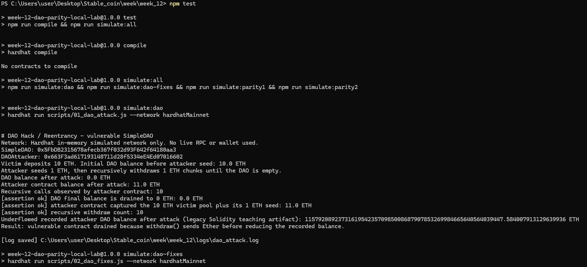
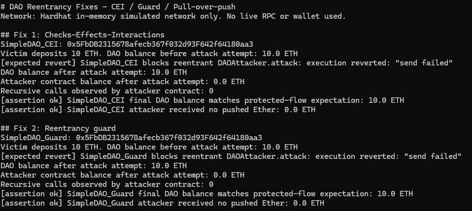
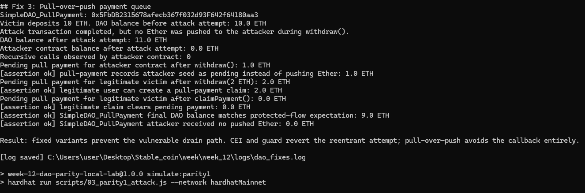
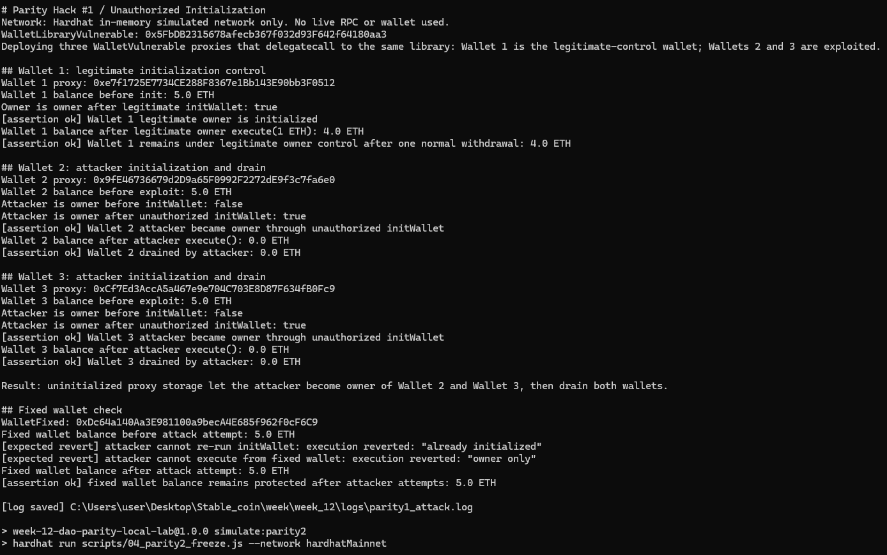

# Week 12 DAO / Parity Smart Contract Security Lab

> **Local Hardhat simulation only.** 이 레포지터리 폴더는 Week 12 smart-contract security 실습을 위한 **offline education package**입니다. **Live network, private key, RPC URL, faucet, wallet, real funds**를 사용하지 않습니다.

이 폴더는 DAO와 Parity 보안 사례를 학생들이 GitHub에서 바로 따라 할 수 있도록 정리한 제출용 패키지입니다. 포함된 산출물은 Solidity contracts, executable Hardhat simulations, retained logs, screenshots, delegatecall storage diagram입니다.

## 1. Assignment objective

이 실습의 목표는 역사적으로 중요한 smart-contract failure mode 3가지를 **controlled local environment**에서 재현하고, 각 문제의 mitigation 또는 final state를 확인하는 것입니다.

1. **DAO Reentrancy** — 잘못된 withdrawal order 때문에 DAO가 drain되고, fixed variants가 reentrant path를 차단하는지 확인합니다.
2. **Parity #1: Unauthorized Initialization** — 초기화되지 않은 proxy wallet이 `delegatecall`을 통해 takeover될 수 있음을 확인하고, constructor initialization으로 방어합니다.
3. **Parity #2: Library Self-Destruct** — shared library가 제거되면 해당 library를 바라보는 wallet funds가 **stolen이 아니라 frozen** 상태가 됨을 확인합니다.

> 핵심 요약: 이 과제는 실제 공격을 실행하는 프로젝트가 아니라, 취약점 원리와 방어 패턴을 이해하기 위한 **local-only security lab**입니다.

## 2. Safety boundary

- **Local Hardhat simulation only** (`--network hardhatMainnet`).
- `hardhatMainnet`은 `hardhat.config.js`에 정의된 **local Hardhat in-memory network alias**입니다. Ethereum mainnet이 아닙니다.
- **No live network, no private key, no RPC URL.**
- **No Remix or localhost web server is required.** 여기의 `.js` 파일은 frontend code가 아니라 Hardhat automation scripts입니다.
- Vulnerable contracts는 교육용으로 의도적으로 unsafe하게 작성되어 있으며, 반드시 이 controlled lab 안에서만 다뤄야 합니다.
- Scripts는 `logs/`에 evidence를 남기기 위한 것이며, live deployment scripts가 아닙니다.
- Parity #2 표현은 중요합니다: 이 재현은 attacker가 wallet balance를 훔치는 것이 아니라, **freeze / loss of access** 상태를 보여줍니다.

## 3. Quick start

GitHub에서 새로 clone한 학생은 아래 순서로 실행하면 됩니다.

```powershell
git clone https://github.com/lee6147/Block_chain.git
cd Block_chain/week/week_12
npm ci
npm test
```

이미 레포지터리를 받아 둔 상태라면 `week_12/` 폴더로 이동해서 실행합니다.

```powershell
cd <your-cloned-repo>/week/week_12
npm ci
npm test
```

Prerequisite: Node.js와 npm이 설치되어 있어야 합니다. `package-lock.json`이 포함되어 있으므로 clean checkout에서는 `npm ci`를 권장합니다. 복사된 폴더에서 `npm ci`가 실패하면 fallback으로 `npm install`을 사용할 수 있습니다.

`npm test`가 이 과제의 main verification gate입니다. 내부적으로 compile 후 전체 simulation을 실행합니다.

```powershell
npm run compile
npm run simulate:dao
npm run simulate:dao-fixes
npm run simulate:parity1
npm run simulate:parity2
```

정상 실행되면 아래 evidence logs가 regenerate / overwrite됩니다.

- `logs/dao_attack.log`
- `logs/dao_fixes.log`
- `logs/parity1_attack.log`
- `logs/parity2_freeze.log`

## 4. Student walkthrough

학생들은 아래 순서로 보면 가장 쉽게 따라갈 수 있습니다.

1. 먼저 **Safety boundary**를 읽고, 이 실습이 local Hardhat lab임을 확인합니다.
2. `npm ci` 후 `npm test`를 실행합니다.
3. `logs/` 안의 4개 log를 열어 각 과제 파트의 결과를 확인합니다.
4. 같은 주제의 vulnerable contract를 `contracts/`에서 읽습니다.
5. 해당 scenario를 재현하는 driver script를 `scripts/`에서 읽습니다.
6. fixed contracts와 fixed-flow log lines를 비교합니다.
7. Parity #1에서 storage write가 헷갈리면 `diagrams/delegatecall_storage_collision.md`를 같이 봅니다.
8. README 하단의 screenshots를 보면서 본인의 terminal output과 expected output을 비교합니다.

권장 읽기 흐름은 `README.md` → `npm test` → `logs/` → `contracts/` → `scripts/` → `diagrams/` → `screenshots/`입니다.

## 5. Repository structure

```text
week_12/
  contracts/
    dao/
      SimpleDAO.sol
      DAOAttacker.sol
      SimpleDAO_CEI.sol
      SimpleDAO_Guard.sol
      SimpleDAO_PullPayment.sol
    parity1/
      WalletLibraryVulnerable.sol
      WalletVulnerable.sol
      WalletFixed.sol
    parity2/
      SharedWalletLibraryVulnerable.sol
      SharedWallet.sol
      SharedWalletLibraryFixed.sol
  scripts/
    01_dao_attack.js
    02_dao_fixes.js
    03_parity1_attack.js
    04_parity2_freeze.js
    lib.js
  logs/
    dao_attack.log
    dao_fixes.log
    parity1_attack.log
    parity2_freeze.log
  diagrams/
    delegatecall_storage_collision.md
  screenshots/
    README.md
    01-npm-test-dao-attack.png
    02-dao-fixes-cei-guard.png
    03-dao-fixes-pull-payment.png
    04-parity1-unauthorized-initialization.png
  07_smart_contract_security_dao_parity (1).html
  student_ai_prompt_week12.md
  hardhat.config.js
  package.json
  package-lock.json
  README.md
```

## 6. Submission boundary

제출 검토의 중심은 executable lab package입니다. 생성된 local tool folder나 cache는 핵심 제출물이 아닙니다.

| Category | Include / rely on | Notes |
| --- | --- | --- |
| Core submission | `contracts/`, `scripts/`, `logs/`, `diagrams/`, `README.md`, `package.json`, `package-lock.json`, `hardhat.config.js` | 3개 과제 파트와 local verification path를 증명하는 핵심 파일입니다. |
| Visual evidence | `screenshots/` | 사람이 보기 쉽게 추가한 console screenshots입니다. Primary evidence는 text logs입니다. |
| Auxiliary study material | `07_smart_contract_security_dao_parity (1).html`, `student_ai_prompt_week12.md` | 학습과 AI prompt 보조자료입니다. 핵심 executable evidence는 아닙니다. |
| Regenerable local output | `artifacts/`, `cache/`, `node_modules/` | install / compile / test 과정에서 생성됩니다. 수작업 제출물로 보지 않습니다. |
| Agent/runtime state | `.omx/` | local workflow state입니다. 과제 evidence가 아닙니다. |

## 7. Assignment-to-file mapping

| Assignment part | What is demonstrated | Core contracts | Run script | Evidence output | Supporting material |
| --- | --- | --- | --- | --- | --- |
| DAO Reentrancy | External call before balance update가 recursive withdrawal을 허용하고, CEI / guard / pull-payment가 이를 막습니다. | `contracts/dao/*` | `scripts/01_dao_attack.js`, `scripts/02_dao_fixes.js` | `logs/dao_attack.log`, `logs/dao_fixes.log` | 이 README의 vulnerability notes |
| Parity #1 Unauthorized Initialization | Proxy fallback `delegatecall`이 uninitialized proxy storage에 attacker owner를 기록합니다. | `contracts/parity1/*` | `scripts/03_parity1_attack.js` | `logs/parity1_attack.log` | `diagrams/delegatecall_storage_collision.md` |
| Parity #2 Library Self-Destruct | Shared library takeover와 `selfdestruct`가 delegated code를 제거해 proxy wallets를 freeze합니다. | `contracts/parity2/*` | `scripts/04_parity2_freeze.js` | `logs/parity2_freeze.log` | `hardhat.config.js` Merge / Paris settings |

## 8. Scripts

| Command | Purpose |
| --- | --- |
| `npm run compile` | `contracts/` 아래 모든 contracts를 compile합니다. |
| `npm run simulate:dao` | Vulnerable DAO reentrancy replay를 실행하고 `logs/dao_attack.log`를 작성합니다. |
| `npm run simulate:dao-fixes` | CEI, reentrancy guard, pull-payment DAO mitigations를 실행하고 `logs/dao_fixes.log`를 작성합니다. |
| `npm run simulate:parity1` | Parity #1 unauthorized initialization replay와 fixed-wallet check를 실행하고 `logs/parity1_attack.log`를 작성합니다. |
| `npm run simulate:parity2` | Parity #2 library self-destruct freeze replay와 fixed-library check를 실행하고 `logs/parity2_freeze.log`를 작성합니다. |
| `npm run simulate:all` | 4개 simulation scripts를 순서대로 모두 실행합니다. |
| `npm test` | Full submission gate: compile 후 `simulate:all`을 실행합니다. |

## 9. Expected results

### 9.1 DAO Reentrancy

Core files:

- `contracts/dao/SimpleDAO.sol`
- `contracts/dao/DAOAttacker.sol`
- `contracts/dao/SimpleDAO_CEI.sol`
- `contracts/dao/SimpleDAO_Guard.sol`
- `contracts/dao/SimpleDAO_PullPayment.sol`

Expected vulnerable flow:

1. Victim이 `SimpleDAO`에 10 ETH를 deposit합니다.
2. Attacker가 1 ETH를 seed합니다.
3. `SimpleDAO`가 recorded balance를 줄이기 전에 `DAOAttacker.receive()`가 `withdraw()`로 re-enter합니다.
4. DAO balance는 0 ETH가 되고, attacker contract balance에는 captured funds가 기록됩니다.

Vulnerable ordering:

```solidity
(bool ok, ) = payable(msg.sender).call{value: amount}("");
require(ok, "send failed");
balances[msg.sender] -= amount;
```

Fix coverage:

- `SimpleDAO_CEI.sol`은 external call 전에 balance를 먼저 줄입니다. 이것이 **Checks-Effects-Interactions (CEI)** pattern입니다.
- `SimpleDAO_Guard.sol`는 local guard로 recursive `withdraw()`를 차단합니다.
- `SimpleDAO_PullPayment.sol`은 withdrawal을 queue에 넣어 vulnerable contract가 첫 `withdraw()` 중 Ether를 push하지 않게 합니다.

Compatibility note: vulnerable replay는 교육을 위해 legacy-style behavior를 포함합니다. `dao_attack.log`의 큰 underflowed recorded balance는 demonstration artifact이며, modern-contract에서 원하는 동작이 아닙니다.

### 9.2 Parity #1: Unauthorized Initialization

Core files:

- `contracts/parity1/WalletLibraryVulnerable.sol`
- `contracts/parity1/WalletVulnerable.sol`
- `contracts/parity1/WalletFixed.sol`
- `diagrams/delegatecall_storage_collision.md`

Expected vulnerable flow:

1. Vulnerable wallet library 1개가 deploy됩니다.
2. Proxy wallets 3개가 같은 library로 delegate합니다.
3. Wallet 1은 legitimate owner가 initialize하여 정상 owner control을 보입니다.
4. Wallet 2와 Wallet 3은 uninitialized 상태로 남습니다.
5. Attacker가 각 uninitialized proxy fallback을 통해 `initWallet([attacker], 1)`을 호출합니다.
6. `delegatecall`이 각 proxy storage에 attacker ownership을 기록합니다.
7. Attacker가 `execute()`를 호출해 Wallet 2와 Wallet 3을 drain합니다.

Expected fixed flow:

- `WalletFixed`는 constructor에서 ownership을 initialize합니다.
- `initWallet()` 재호출은 `already initialized`로 revert됩니다.
- Attacker의 `execute()`는 `owner only`로 revert됩니다.

### 9.3 Parity #2: Library Self-Destruct

Core files:

- `contracts/parity2/SharedWalletLibraryVulnerable.sol`
- `contracts/parity2/SharedWallet.sol`
- `contracts/parity2/SharedWalletLibraryFixed.sol`

Expected vulnerable flow:

1. Vulnerable shared library 1개가 deploy됩니다.
2. Funded `SharedWallet` proxies 3개가 legitimate owner로 initialize되고 같은 shared library를 가리킵니다.
3. Library contract 자체가 직접 initialize될 수 있습니다.
4. Attacker가 library own storage의 owner가 됩니다.
5. Attacker가 `killLibrary()`를 호출합니다.
6. 각 proxy는 여전히 같은 library address를 가리키지만, 그 address의 code가 사라집니다.
7. Owner의 `execute()` calls는 fail하고 wallet balances는 제자리에 남습니다.

> **Important:** Parity #2 freezes funds; it does not transfer wallet funds to the attacker.

Expected fixed flow:

- `SharedWalletLibraryFixed`는 direct library-instance initialization을 비활성화합니다.
- `killLibrary()` / `selfdestruct` entrypoint를 제공하지 않습니다.
- Fixed library를 사용하는 wallet은 legitimate owner가 계속 사용할 수 있습니다.

## 10. Why Hardhat uses Merge / Paris here

`hardhat.config.js`는 아래 설정을 사용합니다.

- Solidity EVM version: `paris`
- Hardhat simulated network hardfork: `merge`

이 설정은 의도된 것입니다. Modern Cancun / Prague semantics에서는 `SELFDESTRUCT` behavior가 바뀌었기 때문에, Parity #2의 historical replay에서 shared-library code가 사라지고 proxy wallets가 freeze되는 모습을 보여주려면 pre-Cancun behavior가 필요합니다.

## 11. Core deliverables checklist

- [x] Vulnerable Solidity contracts for DAO, Parity #1, and Parity #2
- [x] Attacker / exploit simulation scripts
- [x] Fixed Solidity contracts or fixed-library variants
- [x] Transaction / result logs under `logs/`
- [x] Delegatecall storage-collision diagram under `diagrams/`
- [x] Local-only safety boundary
- [x] One-command verification through `npm test`
- [x] Inline screenshots for easier student comparison

## 12. Auxiliary materials

아래 파일은 학습이나 prompt 작성에 유용하지만, core executable submission evidence는 아닙니다.

- `07_smart_contract_security_dao_parity (1).html` — DAO와 Parity 주제의 teaching / reference HTML입니다.
- `student_ai_prompt_week12.md` — student-facing AI prompt / support note입니다.

## 13. Visual evidence screenshots

Screenshots는 reviewer와 학생이 expected terminal output을 쉽게 비교하도록 넣은 보조 evidence입니다. 하지만 `logs/` 아래 text logs가 reproducible하고 비교하기 쉬우므로 canonical evidence입니다.

| Screenshot file | Shows | Canonical log |
| --- | --- | --- |
| `screenshots/01-npm-test-dao-attack.png` | `npm test` 시작과 vulnerable DAO reentrancy drain output | `logs/dao_attack.log` |
| `screenshots/02-dao-fixes-cei-guard.png` | CEI와 local reentrancy guard가 reentrant path를 차단하는 장면 | `logs/dao_fixes.log` |
| `screenshots/03-dao-fixes-pull-payment.png` | Pull-over-push 방식으로 callback path를 피하고 claim behavior를 유지하는 장면 | `logs/dao_fixes.log` |
| `screenshots/04-parity1-unauthorized-initialization.png` | Parity #1 unauthorized initialization과 fixed-wallet protection | `logs/parity1_attack.log` |

### DAO attack run



### DAO CEI and guard fixes



### DAO pull-payment fix



### Parity #1 unauthorized initialization



Parity #2는 `logs/parity2_freeze.log`에 완전히 기록되어 있습니다. 위 screenshots는 log를 대체하지 않습니다.

## 14. Verification checklist for reviewers

Reviewer 또는 학생은 `week_12/`에서 아래 명령을 실행합니다.

```powershell
npm test
Get-ChildItem logs
Get-Content logs/dao_attack.log -Tail 8
Get-Content logs/dao_fixes.log -Tail 8
Get-Content logs/parity1_attack.log -Tail 8
Get-Content logs/parity2_freeze.log -Tail 8
```

Pass criteria:

- Compile succeeds.
- DAO attack log가 vulnerable DAO drained to 0 ETH를 보여줍니다.
- DAO fixes log가 CEI / guard reverts와 pull-payment safe path를 보여줍니다.
- Parity #1 log가 uninitialized wallets drained와 fixed wallet protected를 보여줍니다.
- Parity #2 log가 wallet balances가 stolen이 아니라 frozen in place임을 보여주고, fixed shared-library wallet이 계속 usable함을 보여줍니다.

## 15. Troubleshooting

- `npm ci`가 실패하면 먼저 Node.js / npm 설치 여부를 확인하고, 복사본 폴더라면 `npm install`을 시도합니다.
- `hardhatMainnet`이라는 이름 때문에 혼동하지 마세요. 이것은 **local Hardhat network alias**이며 real mainnet이 아닙니다.
- Screenshots와 본인 출력이 줄 단위로 완전히 같지 않아도 됩니다. 핵심은 `logs/`의 pass criteria가 맞는지입니다.
- Parity #2에서 “왜 돈이 attacker에게 안 갔지?”라고 느껴진다면 정상입니다. 이 case의 핵심은 theft가 아니라 **funds freeze**입니다.
