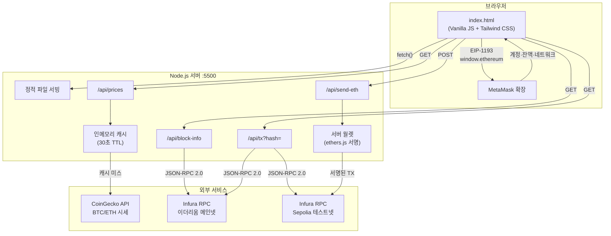
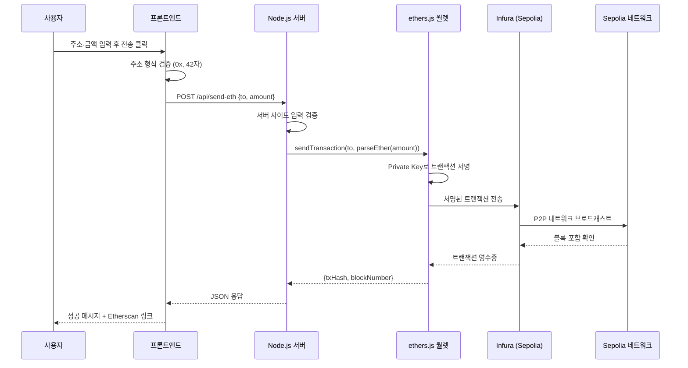

# Week 2 — Wallet & Price Tracker

MetaMask 지갑 연결과 실시간 암호화폐 가격 추적을 결합한 블록체인 교육용 웹 애플리케이션.

> Sepolia 테스트넷 ETH 전송, 이더리움 블록 조회, 트랜잭션 검색까지 지원합니다.


---

## 주요 기능

| 기능 | 설명 |
|------|------|
| **지갑 연결** | MetaMask 연동 (EIP-1193), 계정/네트워크 전환 감지, 잔액 조회 |
| **실시간 가격** | BTC/ETH 시세 (USD·KRW), 24시간 변동률, 시가총액, 30초 자동 갱신 |
| **블록 정보** | 이더리움 메인넷 최신 블록 번호, 트랜잭션 수, 가스 사용량, 검증자 주소 |
| **트랜잭션 조회** | 해시 기반 검색, 메인넷/Sepolia 자동 판별, 상태·금액·가스 정보 |
| **ETH 전송** | Sepolia 테스트넷 서버 월렛에서 ETH 전송, Etherscan 링크 제공 |
| **다크 모드** | 시스템 설정 연동 + 수동 토글, localStorage 저장 |

---

## 기술 스택

**백엔드** — Node.js (프레임워크 없음, `http`/`https`/`fs` 네이티브 모듈)

**블록체인** — ethers.js v6, Infura JSON-RPC, CoinGecko API

**프론트엔드** — Vanilla JavaScript (ES6+), Tailwind CSS v3, 반응형 디자인

---

## 프로젝트 구조

```
├── server.js                 # Node.js 백엔드 서버 (API 프록시, ETH 전송)
├── index.html                # 메인 프론트엔드 (한국어)
├── index_en.html             # 영문 버전
├── presentation.html         # 프레젠테이션 슬라이드
├── start.bat                 # Windows 실행 스크립트
├── 코드_핵심_설명서.md        # 코드 설명 문서
├── 이더리움_트랜잭션_과정.md   # 이더리움 트랜잭션 학습 자료
└── package.json              # 의존성: ethers.js
```

---

## 시작하기

### 사전 요구사항

- **Node.js** (npm 포함)
- **MetaMask** 브라우저 확장 프로그램

### 설치 및 실행

```bash
# 1. 의존성 설치
npm install

# 2. 서버 실행 (http://localhost:5500)
node server.js
```

또는 Windows에서 `start.bat`을 더블 클릭하면 서버 실행 + 브라우저가 자동으로 열립니다.

> **주의:** `file://` 프로토콜로 열면 MetaMask가 작동하지 않습니다. 반드시 `http://localhost:5500`으로 접속하세요.

---

## 아키텍처

### 전체 시스템 구조



### 데이터 흐름: ETH 전송



### API 엔드포인트

| 엔드포인트 | 메서드 | 설명 |
|-----------|--------|------|
| `/api/prices` | GET | BTC/ETH 실시간 시세 (CoinGecko) |
| `/api/block-info` | GET | 이더리움 메인넷 최신 블록 정보 |
| `/api/tx?hash=0x...` | GET | 트랜잭션 해시로 상세 정보 조회 |
| `/api/send-eth` | POST | Sepolia 테스트넷 ETH 전송 |
| `/api/wallet-info` | GET | 서버 월렛 주소·잔액 조회 |

---

## 핵심 코드 설명

### MetaMask 연결 (EIP-1193)

```javascript
// 다중 감지 방식: 직접 확인 → ethereum#initialized 이벤트 → EIP-6963 → 폴링
async function connectWallet() {
  const provider = new ethers.BrowserProvider(window.ethereum);
  await provider.send('eth_requestAccounts', []);
  // 계정 전환·네트워크 전환 이벤트 리스너 등록
  window.ethereum.on('accountsChanged', handleAccountChange);
  window.ethereum.on('chainChanged', () => window.location.reload());
}
```

### 가격 데이터 캐싱

```javascript
// 30초 인메모리 캐시로 CoinGecko API 호출 최소화
var priceCache = { data: null, timestamp: 0 };

function fetchCoinGecko(callback) {
  if (priceCache.data && (Date.now() - priceCache.timestamp) < 30000) {
    return callback(null, priceCache.data); // 캐시 반환
  }
  // HTTPS 요청 → 캐시 갱신 → 콜백
}
```

### Infura JSON-RPC 통신

```javascript
// 이더리움 표준 JSON-RPC 2.0 프로토콜
var postData = JSON.stringify({
  jsonrpc: '2.0',
  method: 'eth_blockNumber',
  params: [],
  id: 1,
});
```

### Sepolia ETH 전송 (서버 사이드)

```javascript
// ethers.js로 서버 월렛에서 서명 후 전송
const wallet = new ethers.Wallet(PRIVATE_KEY, provider);
const tx = await wallet.sendTransaction({
  to: toAddress,
  value: ethers.parseEther(amount),
});
const receipt = await tx.wait(); // 블록 포함 대기
```

---

## 보안 참고사항

이 프로젝트는 **교육/학습 목적**으로 설계되었습니다.

- Private Key는 **Sepolia 테스트넷 전용**으로 서버에 하드코딩되어 있음
- Infura API Key는 공개 키 (요청 제한 있음)
- 디렉토리 탐색 공격 방지, 입력 검증, MIME 타입 검증 적용됨

**프로덕션 환경에서는:** 환경변수로 키 관리, HTTPS 적용, 인증 시스템 추가가 필요합니다.

---

## 문서

- [`코드_핵심_설명서.md`](./코드_핵심_설명서.md) — 코드 흐름별 상세 설명 (비유 포함)
- [`이더리움_트랜잭션_과정.md`](./이더리움_트랜잭션_과정.md) — 이더리움 트랜잭션 라이프사이클

---

## 라이선스

이 프로젝트는 학습 목적으로 제작되었습니다.
